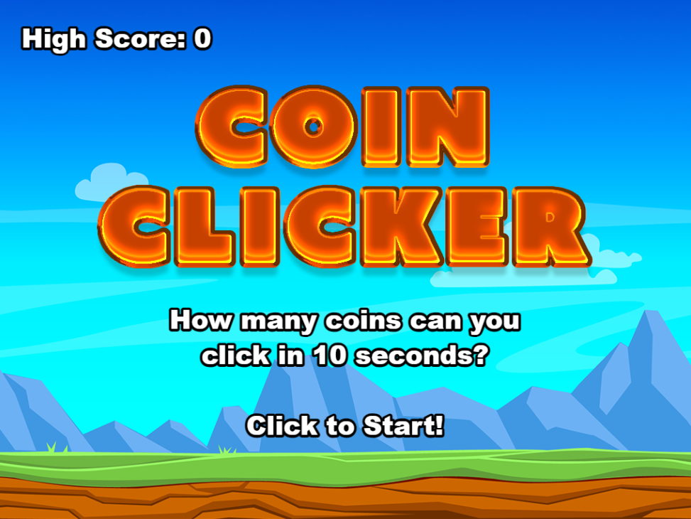
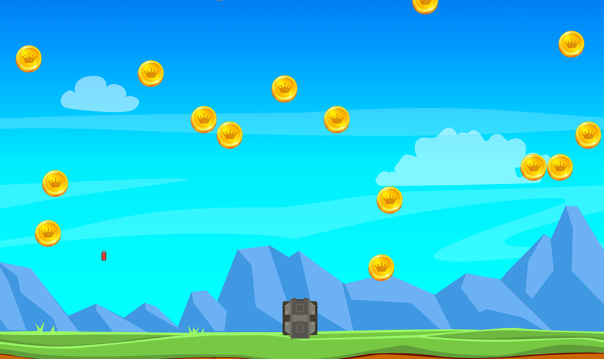
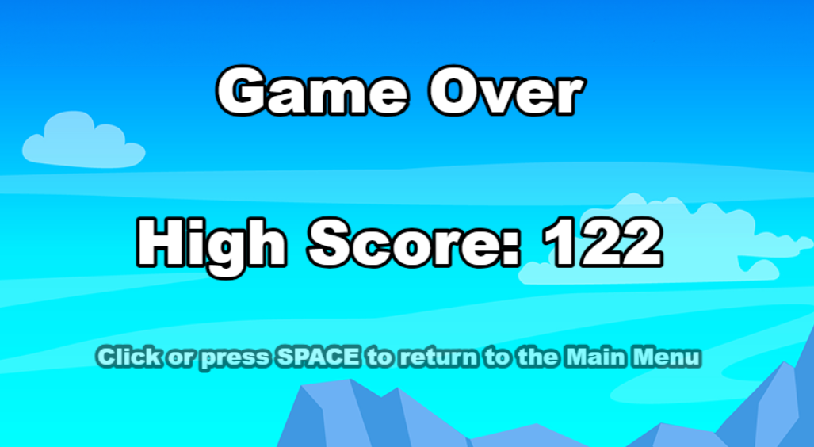

# Coin Clicker

This is a simple Phaser-powered coin clicker and tank shooter game. The goal is to shoot or click as many coins as possible before time runs out, while avoiding falling enemy lasers.

## Features

- Move the tank left and right using the arrow keys.
- Shoot lasers with the spacebar to hit coins.
- Click coins directly for extra points.
- Avoid falling enemy lasers—if the tank is hit, it's game over!
- High scores are tracked and celebrated with a bigger tank.
- Start the game or return to the main menu with a mouse click or the spacebar.

## Instructions

1. Clone the repository.
2. Install dependencies with `npm install`.
3. Start the development server with `npm run dev`.
4. To build the project, run `npm run build`.

## Controls

- **Arrow keys:** Move the tank left/right
- **Spacebar:** Shoot lasers / Start game / Return to menu
- **Mouse:** Click coins / Start game / Return to menu

## Assets

- Tank and coin sprites from [Kenney.nl](https://kenney.nl/assets) and [OpenGameArt](https://opengameart.org/).

## Screenshots

### Main Menu

### In Game

### Game Over
